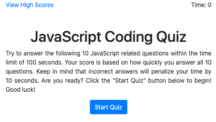
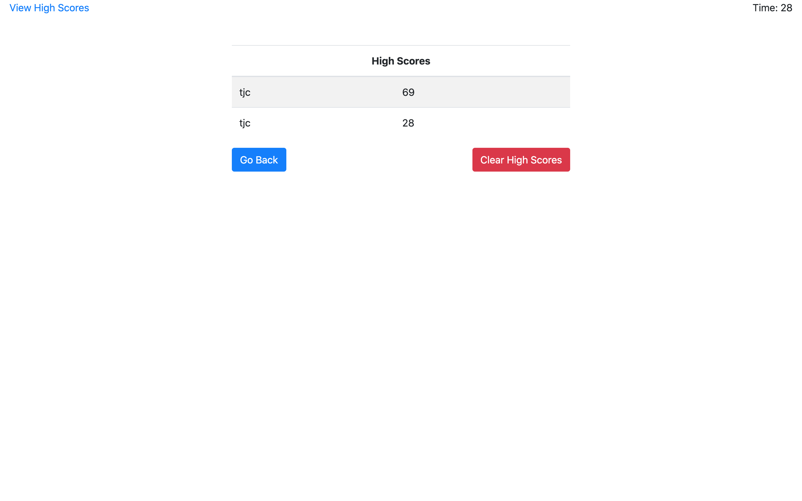

# [Code Quiz](https://thadkingcole.github.io/code_quiz/)

 

A timed quiz of JavaScript coding questions using the HTML DOM API.

This page features:

- [x] dynamically updating HTML according to how the user interacts with the page.
- [x] highscores saved in the browser's localstorage so that user can track progress or compare with friends.
- [x] a fun way to test & improve your JavaScript knowledge.

## Table of Contents

- [Installation](#installation)
- [Usage](#usage)
- [Additional Features](#additional-features)
- [License](#license)

## Installation

No installation necessary! Try it out yourself by [clicking here](https://thadkingcole.github.io/code_quiz/).

## Usage

1. Navigate to <https://thadkingcole.github.io/code_quiz/>
1. Read and understand the directions. Click the "start quiz" button to begin.
1. Answer the questions as best you can. Keep in mind the following:
   1. Incorrect answers subtract 10 seconds from the clock.
   1. Your final score will be how much time is remaining on the clock when you answer the final question.
   1. If you run out of time prior to answering all questions, your final score will be 0.
1. Enter your initials to save your score to the highscore table
1. You can clear highscores at anytime by clicking the "clear highscores" button.

## Additional Features

- Questions appear in a random order
- Answers for each question appear in a random order

## License

[GPL 3.0](LICENSE)

[back to top](#code-quiz)
